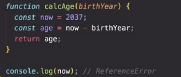
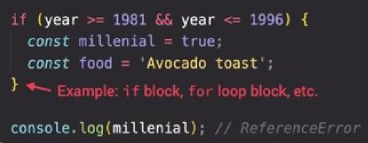
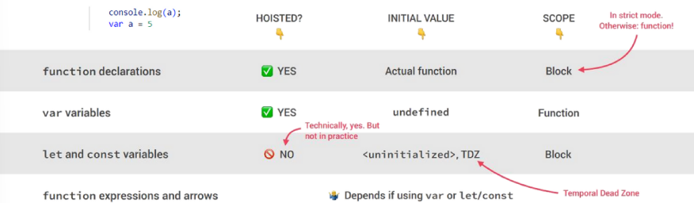
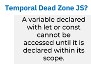

# TABLE OF CONTENTS
## 1.Scope
## 2.Hoisting
# 
#
# What is scope in JavaScript

# JavaScript has 4 types of scope:
# 1.Glabal Scope has access to all of the screen or our prodram
# 2.Function Scope has access to only inside of scope
# 3.Block Scope has access to only if and for 
# Module ,we will pass it one day🧗‍♂️
# what is Hoisting?
## 3 type of Scopes
# 1.Global Scope:

# 2.Function Scope:

# 3.Block Scope:

#
#
# What is Hoisting in JavaScript?
## Hosting is machanism in js mechasinm that variable in the top and function in the bottom
## Hosting work in function and actually in var variable 
## But it not work with let or const variables

